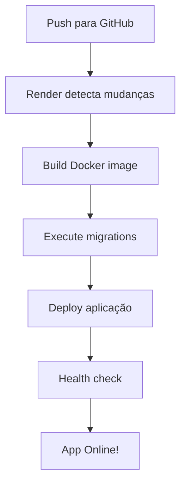

# ⚠️ IMPORTANTE - Leia Antes de Fazer Deploy

## Arquivos Sensíveis

Este repositório contém um arquivo `.env.example` que deve ser usado como template.
**NUNCA** commite o arquivo `.env` com dados reais!

## Configuração no Render

### Opção 1: Configuração Manual (Recomendado)
Siga o guia completo em [DEPLOY_RENDER.md](./DEPLOY_RENDER.md)

### Opção 2: Usando render.yaml
Se preferir usar o arquivo `render.yaml` para configuração automatizada:

1. **ANTES de fazer o deploy**, você precisa:
   - Gerar secrets seguros para JWT
   - Atualizar o arquivo `render.yaml` com seus valores

2. **Gerando JWT Secrets:**
```bash
# Execute este comando 2 vezes para gerar 2 secrets diferentes
node -e "console.log(require('crypto').randomBytes(64).toString('hex'))"
```

3. **Edite o render.yaml:**
   - Substitua os valores de `JWT_SECRET` e `JWT_REFRESH_SECRET`
   - Verifique se a URL do frontend está correta em `CORS_ORIGIN`

4. No Dashboard do Render:
   - Conecte seu repositório
   - O Render detectará automaticamente o `render.yaml`
   - Revise as configurações antes de criar os serviços

## Checklist Pré-Deploy

- [ ] Arquivo `.env` está no `.gitignore`
- [ ] Secrets JWT foram gerados
- [ ] `render.yaml` foi revisado (se usar)
- [ ] URL do frontend da Vercel está correta
- [ ] Dockerfile e .dockerignore estão presentes
- [ ] CORS configurado no `src/main.ts` inclui a URL da Vercel

## Fluxo de Deploy



## Variáveis de Ambiente Essenciais

Estas são as variáveis **obrigatórias** para o funcionamento:

- `DATABASE_HOST` / `DATABASE_URL`
- `JWT_SECRET`
- `JWT_REFRESH_SECRET`
- `NODE_ENV=production`
- `CORS_ORIGIN`

## Migrations

As migrations devem ser executadas **após** o primeiro deploy bem-sucedido:

```bash
# No Shell do Render
npm run migration:run
```

Ou configure no **Build Command**:
```bash
npm ci && npm run build && npm run migration:run
```

## Suporte

Problemas? Consulte:
- [DEPLOY_RENDER.md](./DEPLOY_RENDER.md) - Guia completo
- [Render Documentation](https://render.com/docs)
- Issues do projeto no GitHub

---

**Boa sorte com o deploy! 🚀**
